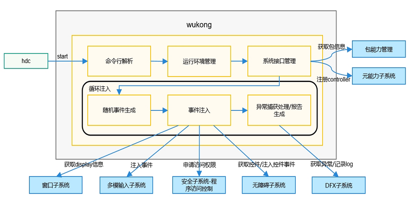

# wukong部件
## 简介

OpenHarmony稳定性测试自动化工具，通过模拟用户行为，对OpenHarmony系统及应用进行稳定性压力测试。<br>

wukong部件架构图<br>
<br>

部件内子模块职责：<br>
1. 命令行解析：支持命令行获取参数并解析命令行参数。<br>
2. 运行环境管理：根据命令行初始化wukong整体运行环境。<br>
3. 系统接口管理：检查并获取指定的mgr，注册controller和dfx的faultlog的回调函数。<br>
4. 随机事件生成：通过random函数生成指定种子数的随机序列，生成事件。<br>
5. 事件注入：根据支持的事件类型向系统注入事件，依赖窗口、多模、安全等子系统。<br>
6. 异常捕获处理/报告生成：通过DFX子系统获取运行中的异常信息并记录log，生成报告。<br>

## 目录

```
├── wukong                              # wukong主要代码文件
|   └── common                          # 提供应用管控能力，随机事件注入能力，多模事件注入能力
|   └── component_event                 # 定义ability、page、Component树，提供添加节点、遍历树、依据NodeId查找子节点等能力
|   └── input_factory                   # 实现屏幕点击、滑动、拖拽、键盘等事件注入能力    
|   └── report                          # 监听异常信息，对其进行收集、统计、显示功能
|   └── shell_command                   # 用来创建命令行map,解析命令行参数并执行命令行               
|   └── test_flow                                  
│       └── include                     # 定义头文件
│       └── src                     
│           ├── random_test_flow.cpp    # 继承TestFlow,是随机测试的执行流
│           ├── special_test_flow.cpp   # 继承TestFlow,是顺序专项测试的执行流
│           ├── focus_test_flow.cpp     # 继承TestFlow,是专注测试的执行流
│           ├── test_flow.cpp           # 检查命令行参数是否符合规范
│   ── BUILD.gn                         # 存放wukong构建的配置，具体包括构建对象、方式、依赖、硬件架构、文件格式
│   ── README_zh.md                     # readme文件
```

## 约束

1. wukong在3.2系统版本后开始预置使用。<br>
2. wukong在3.2系统版本之前的版本不随版本编译，使用时需自行编译后推送至被测OpenHarmony设备，步骤如下：        
    2.1. 构建方式
    ```
    ./build.sh --product-name rk3568 --build-target wukong
    ```
    2.2. 推送方式
    ```
    hdc_std shell mount -o rw,remount /
    hdc_std file send wukong /
    hdc_std shell chmod a+x /wukong
    hdc_std shell mv /wukong /bin/
    ```

## 使用说明

### 功能特性及命令说明


| 命令           | 说明                                           | 备注          |
| -------------- | ---------------------------------------------- | ------------- |
| version | 获取wukong版本信息。                             | -v, --version。 |
| help    | 获取wukong帮助信息。                             |              |
| appinfo | 查询支持拉起应用bundleName和对应的mainAbility名。 |               |
| special | wukong专项测试。                                   |               |
| exec    | wukong随机测试。                                   |               |
| focus   | wukong专注测试。                                   |               |


### wukong special描述

| 命令                | 功能                   | 必选 | 备注                |
| :------------------ | ---------------------- | ---- | :------------------ |
| -h, --help          | 获取当前测试的帮助信息。 | 否   | 专项测试帮助信息。    |
| -k, --spec_insomnia | 休眠唤醒专项测试。       | 否   | -                   |
| -c, --count         | 设置执行次数。           | 否   | 默认10次。            |
| -i, --interval      | 设置执行间隔。           | 否   | 单位ms，默认1500ms。  |
| -S, --swap          | 滑动测试。               | 否   | -                   |
|-s, --start[x,y]    | 设置滑动测试起点坐标。   | 否   | -                   |
| -e, --end[x,y]      | 设置滑动测试终点坐标。   | 否   | -                   |
| -b, --bilateral     | 设置往返滑动。           | 否   | 默认不往返滑动。      |
| -t, --touch[x,y]    | 点击测试。               | 否   | -                   |
| -T, --time          | 设置测试总时间。         | 否   | 单位分钟，默认10分钟。 |
| -C, --component     | 控件顺序遍历测试。       | 否   | 需要设置测试应用名称。 |
| -r, --record     | 录制。       | 否   | 需要指定录制文件。 |
| -R, --replay    |  回放。      | 否   | 需要指定回放文件。 |
| -p, --screenshot    |  控件测试截图。      | 否   | - |

#### wukong special 专项测试使用示例
```bash
> hdc_std shell
# wukong special -C [bundlename] -p
```
专项测试示例解析：
| 命令           | 参数值           | 说明                                           |
| -------------- |-------------- | ---------------------------------------------- |
| wukong special |  | 主命令。                             |
| -C [bundlename]    |[bundlename] | 控件顺序遍历测试参数设置，bundlename为测试应用名称。            |
| -p |  | 表示截图。                             |

### wukong random描述

| 命令            | 功能                                 | 必选 | 备注                                     |
| --------------- | ------------------------------------ | ---- | ---------------------------------------- |
| -h,--help       | 获取当前测试的帮助信息。               | 否   | 随机测试帮助信息。                         |
| -c,--count      | 设置执行次数，与-T冲突。                         | 否   | 单位次数，默认10次。                       |
| -i,--interval   | 设置执行间隔。                         | 否   | 单位ms，默认1500ms。                       |
| -s,--seed       | 设置随机种子。                         | 否   | 配置相同随机种子，会生成相同随机事件序列。 |
| -b,--bundle[bundlename,……,bundlename]     | 设置本次测试的允许应用名单，与-p冲突。 | 否   | 默认测试当前设备所有应用(应用名称用逗号隔开)。                 |
| -p,--prohibit[bundlename,……,bundlename]   | 设置本次测试的禁止应用名单，与-b冲突。 | 否   | 默认不禁止任何应用(应用名称用逗号隔开)。                       |
| -d,--page[page,……,page]                   | 设置本次测试的禁止页面名单 | 否  | 系统默认禁止pages/system页面(页面名称用逗号隔开)。 |
| -a,--appswitch  | 设置应用随机拉起测试比例。             | 否   | 默认10%。                                  |
| -t,--touch      | 设置屏幕随机touch测试比例。            | 否   | 默认10%。                                  |
| -S,--swap       | 设置屏幕随机swap测试比例。             | 否   | 默认3%。                                   |
| -m,--mouse      | 设置屏幕随机mouse测试比例。            | 否   | 默认1%。                                   |
| -k,--keyboard   | 设置屏幕随机keyboard测试比例。         | 否   | 默认2%。                                   |
| -H,--hardkey    | 设置随机hardkey测试比例。              | 否   | 默认2%。                                   |
| -r,--rotate     | 设置随机rotate测试比例。               | 否   | 默认2%。                                   |
| -C, --component | 设置随机控件测试比例。                 | 否   | 默认70%。                                  |
| -T,--time       | 设置测试总时间，与-c冲突。                       | 否   | 单位分钟，默认10分钟。                      |

> 说明：配置相同随机种子，会生成相同随机事件序列

#### wukong exec 随机测试使用示例
```bash
> hdc_std shell
# wukong exec -s 10 -i 1000 -a 0.28 -t 0.72 -c 100
```
随机测试示例解析：
| 命令           | 参数值           | 说明                                           |
| -------------- | -------------- | ---------------------------------------------- |
| wukong exec |           | 主命令。                             |
| -s     | 10           | 参数设置随机种子，10为种子值。            |
| -i  | 1000           | 参数设置应用拉起间隔，1000单位ms。 |
| -a  | 0.28          | 参数设置应用随机拉起测试比例28%。          |
| -t  | 0.72           | 参数设置屏幕随机touch测试比例为72%。    |
| -c  | 100           | 参数设置执行次数为100次。                |

### wukong focus描述
| 命令            | 功能                                 | 必选 | 备注                                     |
| --------------- | ------------------------------------ | ---- | ---------------------------------------- |
| -n,--numberfocus       | 设置每个控件注入的次数。               | 否   |                         |
| -f, --focustypes       | 设置需要专注的控件类型。               | 否   | 以英文逗号隔开。                         |
其余参数继承自exec。

## 版本说明

3.2.0.0 版本发布内容：预置wukong，支持以下功能：<br>
1. 支持整机应用拉起、设置随机种子、设置应用拉起间隔、设置应用拉起次数、支持查询应用拉起bundle名和ability名。<br>
2. 支持随机注入事件、支持随机注入控件、支持休眠唤醒专项测试、支持控件顺序遍历截图专项测试。<br>
3. 支持wukong运行日志打印。<br>
4. 支持应用白、黑名单。